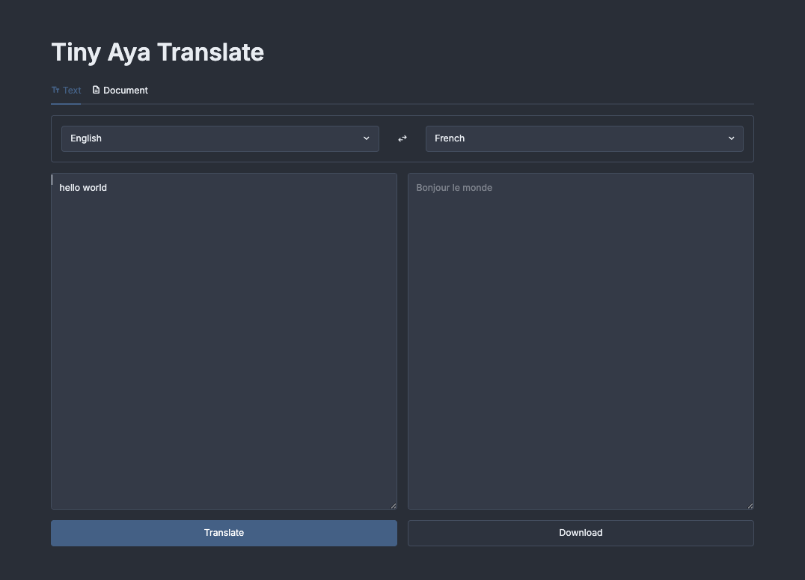

# Tiny Aya Translate

[](https://github.com/darylalim/tiny-aya-translate/actions/workflows/ci.yml)
[](https://github.com/darylalim/tiny-aya-translate/releases)
[](#license)


*Private, on-device translation for Apple Silicon — 67 languages, text and documents, no API key.*

Translate text and whole documents across **67 languages** entirely on your Mac. Tiny Aya Translate runs [Cohere Labs Tiny Aya Global](https://huggingface.co/CohereLabs/tiny-aya-global) locally with [MLX](https://github.com/ml-explore/mlx) — nothing is sent to a server, and no API key is required.

> **Note:** the model weights are licensed **CC-BY-NC (non-commercial only)** — see [License](#license).



## Features

- Local inference — no API key required, nothing leaves your machine
- 67 languages across Europe, West Asia, South Asia, Asia Pacific, and Africa
- Translate text and documents (PDF, DOCX, PPTX, XLSX, HTML) — document support via Docling, optional
- Side-by-side translation with streaming output
- Cached document parsing for fast re-translation
- Swap and download controls
- Nord theme with light and dark modes
- Up to 8K tokens per input and per output
- 8-bit quantized MLX inference on Apple Silicon

## Prerequisites

- Apple Silicon Mac
- 8 GB+ RAM recommended (~4 GB during inference)
- Python 3.13+ (uv installs a matching interpreter from `.python-version` if one isn't on your PATH)
- [uv](https://docs.astral.sh/uv/)

## Setup

```bash
git clone https://github.com/darylalim/tiny-aya-translate.git
cd tiny-aya-translate

uv sync                # core: text translation only
# or, to also translate documents (PDF, DOCX, PPTX, XLSX, HTML):
uv sync --extra docs
```

## Usage

```bash
uv run streamlit run streamlit_app.py
```

First run downloads tiny-aya-global (~3.6 GB); document translation also downloads Docling's layout models on first use. To tune the model or sampling parameters, edit the constants at the top of `streamlit_app.py`. The app ships with a Nord theme in light and dark modes (switch via the app's settings menu); edit `.streamlit/config.toml` to restyle it.

## Development

```bash
uv sync --extra docs                                         # full test suite imports docling
uv run pytest test_streamlit_app.py test_streamlit_ui.py -v  # run tests
uv run ruff check --fix .                                    # lint
uv run ruff format .                                         # format
uv run ty check                                              # type check
```

CI runs the same checks — `ruff format --check`, `ruff check`, and `ty check`, then `pytest` — on every pull request and on pushes to `main`, via GitHub Actions on a `macos-latest` runner (Apple Silicon, so `mlx-lm` installs natively). The checks are non-mutating: `ruff format --check` verifies formatting instead of applying it, so unformatted code fails CI rather than being auto-fixed.

Release history and notes are on the [Releases](https://github.com/darylalim/tiny-aya-translate/releases) page.

## License

The application code in this repository is licensed under the [Apache License 2.0](LICENSE).

It loads [`mlx-community/tiny-aya-global-8bit-mlx`](https://huggingface.co/mlx-community/tiny-aya-global-8bit-mlx) — an 8-bit MLX-quantized fork of [Cohere Labs Tiny Aya Global](https://huggingface.co/CohereLabs/tiny-aya-global) — under [CC-BY-NC](https://cohere.com/c4ai-cc-by-nc-license). The model weights are **non-commercial only**, so running this app commercially would violate the model license regardless of the code license above.
