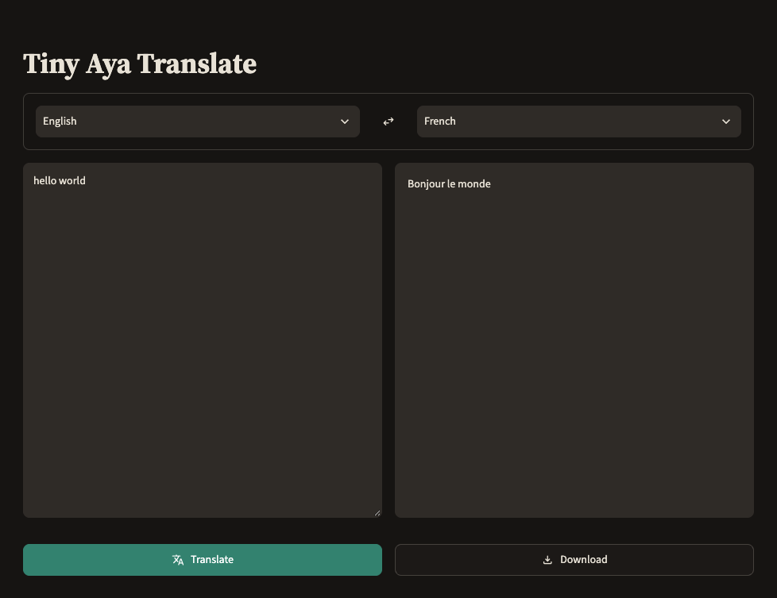

# Tiny Aya Translate

[](https://github.com/darylalim/tiny-aya-translate/actions/workflows/ci.yml)
[](https://github.com/darylalim/tiny-aya-translate/releases)
[](#license)


*Private, on-device translation for Apple Silicon — 67 languages, no API key.*

Translate text across **67 languages** entirely on your Mac. Tiny Aya Translate runs [Cohere Labs Tiny Aya Global](https://huggingface.co/CohereLabs/tiny-aya-global) locally with [MLX](https://github.com/ml-explore/mlx) — nothing you translate leaves your Mac, and no API key is required.

> **Note:** the model weights are licensed **CC-BY-NC (non-commercial only)** — see [License](#license).



## Features

- Local inference — no API key required; your text stays on your machine
- 67 languages across Europe, West Asia, South Asia, Asia Pacific, and Africa
- Side-by-side translation with streaming output
- Swap and download controls
- Its own "Reading Room" theme — a warm ink-and-paper palette designed dark-first, with a light companion; it follows your system appearance and can be switched from the app's settings menu
- Up to 30,000 characters and 8K tokens per input (whichever your text reaches first — the token count includes the translation instruction), and up to 8K tokens per output
- 8-bit quantized MLX inference on Apple Silicon

## Prerequisites

- Apple Silicon Mac
- 8 GB+ RAM recommended (~4 GB during inference)
- Python 3.13+ (uv installs a matching interpreter from `.python-version` if one isn't on your PATH)
- [uv](https://docs.astral.sh/uv/)

## Setup

```bash
git clone https://github.com/darylalim/tiny-aya-translate.git
cd tiny-aya-translate

uv sync
```

## Usage

```bash
uv run streamlit run streamlit_app.py
```

The app opens at <http://localhost:8510> — the port is pinned in `.streamlit/config.toml`, so if something else already holds it the launch stops with an error rather than quietly moving to the next port. The page loads immediately; the first **Translate** click downloads tiny-aya-global (~3.6 GB) from Hugging Face and loads it into memory, so that first translation takes a while and later ones are instant. Each later start of the app repeats one small part of that on its first Translate: an anonymous request to huggingface.co asking whether the model is still current — it carries nothing you translate and no login token — followed by a re-download only if the model has been updated upstream. To tune the model or sampling parameters, edit the constants at the top of `streamlit_app.py`. The app ships with its own "Reading Room" theme — a warm ink-and-paper palette designed dark-first, with a light companion; it follows your system appearance and can be switched via the app's settings menu. Both palettes, and the reasoning behind every value, live in `.streamlit/config.toml`; edit that file to restyle it.

## Development

```bash
uv sync                                                      # install dependencies
uv run pytest -v                                             # run tests
uv run ruff check --fix .                                    # lint
uv run ruff format .                                         # format
uv run ty check                                              # type check
```

CI runs the same checks — `ruff format --check`, `ruff check`, and `ty check`, then `pytest` — on every pull request and on pushes to `main`, via GitHub Actions on a `macos-latest` runner (Apple Silicon, so `mlx-lm` installs natively). The checks are non-mutating: `ruff format --check` verifies formatting instead of applying it, so unformatted code fails CI rather than being auto-fixed.

Releases are automatic. Once the checks pass on `main`, a version bump in `pyproject.toml` is tagged and a GitHub Release is **published** from the conventional commits since the previous tag; the `Release` workflow in the Actions tab does the same thing starting from a `patch`/`minor`/`major` choice. Neither path stops for review, so the commit subjects since the last tag are the release notes — write them accordingly. Release history and notes are on the [Releases](https://github.com/darylalim/tiny-aya-translate/releases) page.

## License

The application code in this repository is licensed under the [Apache License 2.0](LICENSE).

It loads [`mlx-community/tiny-aya-global-8bit-mlx`](https://huggingface.co/mlx-community/tiny-aya-global-8bit-mlx) — an 8-bit MLX-quantized fork of [Cohere Labs Tiny Aya Global](https://huggingface.co/CohereLabs/tiny-aya-global) — under [CC-BY-NC](https://cohere.com/c4ai-cc-by-nc-license). The model weights are **non-commercial only**, so running this app commercially would violate the model license regardless of the code license above.
